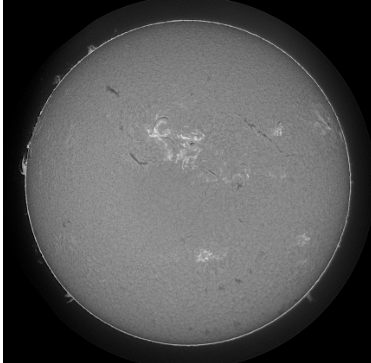
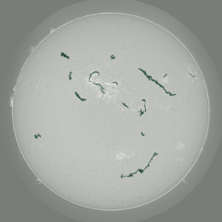
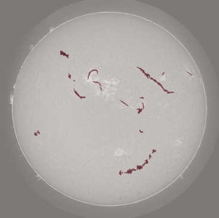

# ☀️ Solar Filament Segmentation

Pixel-level detection of solar filaments in full-disk H-alpha imagery, built for the
[MAGFiLO Kaggle competition](https://www.kaggle.com/competitions/filament-segmentation-2026) (`filament-segmentation-2026`).
A `UNet++` / `resnet34` encoder-decoder finds the thin, curvilinear dark ribbons that mark
filaments against the solar disk — a needle-in-a-haystack problem where filament pixels are
~0.4% of the image.

<p align="center">
  
  
  
</p>
<p align="center"><sub><b>Input</b> &nbsp;·&nbsp; <b>Ground truth</b> (annotator union) &nbsp;·&nbsp; <b>Model prediction</b> (thresholded + connected-component filtered)</sub></p>

---

## The problem

Full-disk solar images are 2048×2048, and the filaments annotators care about are thin,
branching structures that can be a handful of pixels wide and hundreds long — closer to
curve detection than blob segmentation. Three things make this harder than a typical
segmentation task:

- **Extreme class imbalance** — foreground is ~0.4% of pixels, so a model that predicts
  all-background scores deceptively well on naive per-pixel metrics.
- **Disagreeing annotators** — the same image is labeled independently by multiple people,
  with pairwise mask IoU as low as 0.25, so "ground truth" itself is a union, not a
  consensus.
- **Shape matters as much as overlap** — a blobby false positive that happens to overlap a
  thin true filament isn't a good prediction; the competition scores instances, not just
  pixels.

## Approach

| Stage | Choice |
|---|---|
| Model | `UNet++` (`segmentation_models_pytorch`), `resnet34` encoder |
| Input | Single-channel grayscale, ImageNet-luminance normalized so the pretrained encoder still sees the distribution it was trained on |
| Tiling | 2048×2048 images split into overlapping 512×512 tiles (64px overlap), stitched back with overlap-averaging at inference |
| Loss | Dice + positive-weighted BCE, weight tuned against the measured ~1:226 foreground/background pixel ratio |
| Training | AMP mixed precision, `ReduceLROnPlateau` on validation dice, early stopping, file-grouped sampling so per-file image/mask decoding is cached instead of repeated per tile |
| Post-processing | Connected-component labeling + area filtering to drop speckle false positives before scoring/submission |
| Validation | Images are stitched from tiles *before* scoring — dice and instance precision/recall/F1 are computed on full images, matching how the competition actually grades predictions |

### Why validation is stitched, not per-tile

72.8% of training tiles contain no filament at all. Scoring dice per-tile with the usual
smoothing term floors an all-background model at ~0.73 dice — which rewards collapsing to
background exactly when you least want it to. This pipeline stitches predictions back into
full images first, scores dice only on images that actually contain a filament, and reports
correctness on empty images separately. An all-background model now scores close to 0 where
it should, and checkpoint selection reflects real filament-finding ability.

### Instance-aware evaluation

Beyond pixel dice, validation greedily IoU-matches predicted connected components against
ground-truth instances to report precision/recall/F1 — the same shape of metric the
competition uses, so local validation numbers are trustworthy before submitting.

## A few bugs worth mentioning

Getting from a naive baseline to a working pipeline surfaced some non-obvious failures —
the kind that don't throw errors, they just quietly wreck training:

- **Annotations were 41% incomplete.** Image IDs encode `<annotator>-<file>`, so keying
  file → single image silently dropped every annotator but the first, and an overly narrow
  category filter dropped a third label class entirely. Together, over 40% of real filament
  pixels were being fed to the model as background — training data was punishing the model
  for correctly finding filaments.
- **Dice loss silently overflowed under mixed precision.** Summing a 512×512 tile in fp16
  overflows past ~65,504 once the mean sigmoid output exceeds ~0.25, pinning dice loss at
  1.0 and sending NaN gradients that `GradScaler` swallows every step — with no error, no
  warning, forever.
- **A throughput bug turned 26 minutes into a full epoch** for a mistake as simple as
  re-decoding the full 2048² JPEG per 512×512 tile. Per-file caching plus a file-grouped
  sampler fixed it without changing a single training-affecting hyperparameter.

Full write-ups live in [`AUDIT.md`](AUDIT.md) and [`FIX.md`](FIX.md).

## Performance: a hand-rolled C++ extension

Connected-component labeling runs on every validation image and every submission tile.
[`cpp/ccl.cpp`](cpp/ccl.cpp) is a `pybind11` union-find implementation that replaces
`scipy.ndimage.label` + a per-instance mask rebuild, benchmarked against the pure-Python
path in [`cpp/benchmark.py`](cpp/benchmark.py) across dense, sparse, and many-instance mask
shapes representative of what this pipeline actually produces.

## Repo layout

```
segres/            core package: dataset/tiling, model, losses, train/validate, predict
cpp/                pybind11 connected-component labeling extension + benchmark
scripts/            data download + mask precomputation utilities
workflow.ipynb      local train/predict driver
workflow-kaggle.ipynb, predict-kaggle.ipynb   standalone Kaggle-notebook copies
inference-demo.ipynb   single-image inference walkthrough (source of the visuals above)
config.json         pipeline configuration (tiling, loss weights, thresholds)
```

## Running it

```bash
python -m venv venv && source venv/bin/activate
pip install torch segmentation-models-pytorch albumentations pycocotools scipy pandas pillow

# edit config.json for paths, then:
jupyter notebook workflow.ipynb   # train + predict end-to-end
```

`inference-demo.ipynb` runs a single trained checkpoint on one image end-to-end (tiling →
inference → stitching → connected-component filtering → visualization) — the fastest way to
sanity-check a model without a full validation pass.
